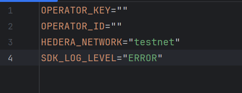

1. Install Intellij Community Edition
2. Install Java 23 [here](https://www.oracle.com/java/technologies/downloads/)
3. Clone this repository
4. Create a new file called ".env" (This will hold your account information later)

5. Add your Hedera account and private key (Leave the quotes)
6. Either hit the Play button in Intellij or type ```./gradlew bootRun```